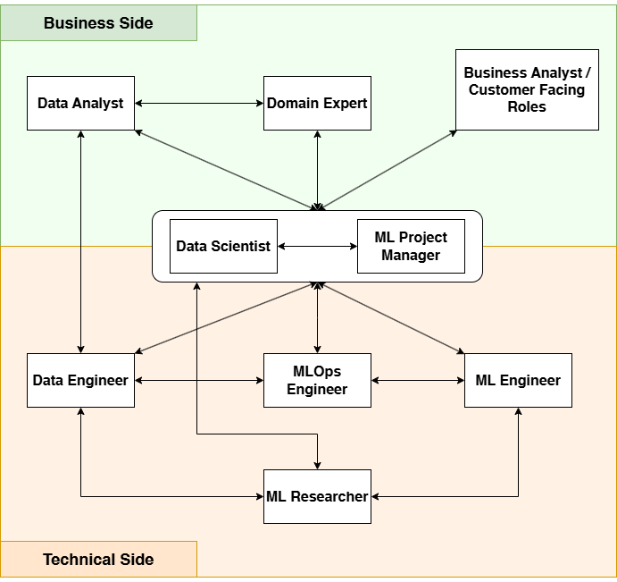

# Roles in an AI team

### Surveyed links:
- [1] https://fullstackdeeplearning.com/spring2021/lecture-13/
- [2] https://www.linkedin.com/advice/0/what-most-important-roles-ai-project-team-5p0cf
- [3] https://newxel.com/blog/roles-of-an-ai-team/
- [4] https://www.linkedin.com/pulse/what-does-ai-development-team-look-like-breakdown-roles-kushan-perera-84fge
- [5] https://enterprisersproject.com/article/2019/6/how-staff-ai-team-11-key-roles
- [6] https://moov.ai/en/blog/nine-critical-roles-for-a-successful-ai-project

## Critical roles of an AI team

### Business side
- Data Analyst
- Domain Expert
- Business Analyst / Customer Facing Roles
### Technical side
- Data Engineer
- MLOps Engineer
- ML Engineer
- ML Researcher
### Cross-section roles
- Data Scientist
- ML Project Manager

## Definitions

## Knowledge and Skills